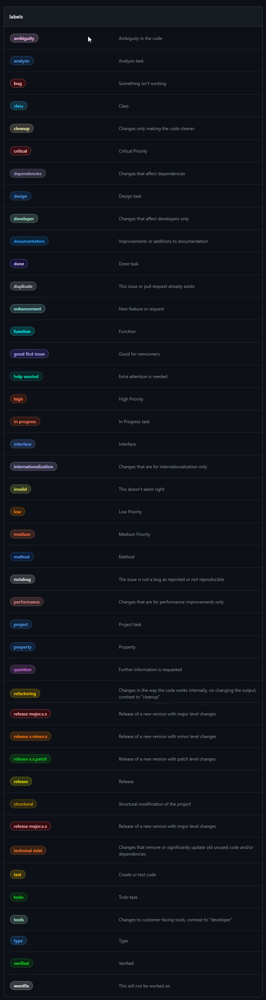

# labels
Labels for GitHub.

## List

---

## Properties

| NAME                     |                   COLOR               |       DESCRIPTION     |
| :----------------        |                 :------              |          ----:        |
| **ambiguity**            | $\color{#ffccff}{\textsf{■}}$ #ffccff | Ambiguity in the code |
| **analysis**             | $\color{#1D76DB}{\textsf{■}}$ #1D76DB | Analysis task |
| **bug**                  | $\color{#FF0000}{\textsf{■}}$ #FF0000 | Something isn't working |
| **class**                | $\color{#33ccff}{\textsf{■}}$ #33ccff | Class |
| **cleanup**              | $\color{#fef2c0}{\textsf{■}}$ #fef2c0 | Changes only making the code cleaner |
| **critical**             | $\color{#fc0307}{\textsf{■}}$ #fc0307 | Critical Priority |
| **dependencies**         | $\color{#b4a8d1}{\textsf{■}}$ #b4a8d1 | Changes that affect dependencies |
| **deprecation**          | $\color{#ff471a}{\textsf{■}}$ #ff471a | Function, method, class, or usage deprecated |
| **design**               | $\color{#1D76DB}{\textsf{■}}$ #1D76DB | Design task |
| **developer**            | $\color{#bcf5db}{\textsf{■}}$ #bcf5db | Changes that affect developers only |
| **documentation**        | $\color{#0075ca}{\textsf{■}}$ #0075ca | Improvements or additions to documentation |
| **done**                 | $\color{#5319E7}{\textsf{■}}$ #5319E7 | Done task |
| **duplicate**            | $\color{#cfd3d7}{\textsf{■}}$ #cfd3d7 | This issue or pull request already exists |
| **enhancement**          | $\color{#a2eeef}{\textsf{■}}$ #a2eeef | New feature or request |
| **function**             | $\color{#00ffff}{\textsf{■}}$ #00ffff | Function |
| **good first issue**     | $\color{#7057ff}{\textsf{■}}$ #7057ff | Good for newcomers |
| **help wanted**          | $\color{#008672}{\textsf{■}}$ #008672 | Extra attention is needed |
| **high**                 | $\color{#FF4500}{\textsf{■}}$ #FF4500 | High Priority |
| **in progress**          | $\color{#D93F0B}{\textsf{■}}$ #D93F0B | In Progress task |
| **interface**            | $\color{#6699ff}{\textsf{■}}$ #6699ff | Interface |
| **internationalization** | $\color{#d4c5f9}{\textsf{■}}$ #d4c5f9 | Changes that are for internationalization only |
| **invalid**              | $\color{#e4e669}{\textsf{■}}$ #e4e669 | This doesn't seem right |
| **low**                  | $\color{#ff8c00}{\textsf{■}}$ #ff8c00 | Low Priority |
| **medium**               | $\color{#FF7F50}{\textsf{■}}$ #FF7F50 | Medium Priority |
| **method**               | $\color{#0052CC}{\textsf{■}}$ #0052CC | Method |
| **notabug**              | $\color{#eeeeee}{\textsf{■}}$ #eeeeee | The issue is not a bug as reported or not reproducible |
| **performance**          | $\color{#e99695}{\textsf{■}}$ #e99695 | Changes that are for performance improvements only |
| **project**              | $\color{#1D76DB}{\textsf{■}}$ #1D76DB | Project task |
| **property**             | $\color{#1D76DB}{\textsf{■}}$ #1D76DB | Property |
| **question**             | $\color{#d876e3}{\textsf{■}}$ #d876e3 | Further information is requested |
| **refactoring**          | $\color{#fbca04}{\textsf{■}}$ #fbca04 | Changes in the way the code works internally, >no changing the output, contrast to "cleanup" |
| **release**              | $\color{#e6e600}{\textsf{■}}$ #e6e600 | Release |
| **release major.x.x**    | $\color{#e60000}{\textsf{■}}$ #e60000 | Release of a new version with major level changes |
| **release x.minor.x**    | $\color{#ff8000}{\textsf{■}}$ #ff8000 | Release of a new version with minor level changes |
| **release x.x.patch**    | $\color{#12ba1e}{\textsf{■}}$ #12ba1e | Release of a new version with patch level changes |
| **structural**           | $\color{#b08d03}{\textsf{■}}$ #b08d03 | Structural modification of the project |
| **task**                 | $\color{#1D76DB}{\textsf{■}}$ #1D76DB | Project task |
| **technical debt**       | $\color{#ff7619}{\textsf{■}}$ #ff7619 | Changes that remove or significantly update old unused code and/or dependencies |
| **test**                 | $\color{#FBCA04}{\textsf{■}}$ #FBCA04 | Create or test code |
| **todo**                 | $\color{#0E8A16}{\textsf{■}}$ #0E8A16 | Todo task |
| **tools**                | $\color{#bcf5db}{\textsf{■}}$ #bcf5db | Changes to customer-facing tools, contrast to "developer" |
| **type**                 | $\color{#3399ff}{\textsf{■}}$ #3399ff | Type |
| **verified**             | $\color{#0e8a16}{\textsf{■}}$ #0e8a16 | Verified |
| **warning**              | $\color{#ff4d4d}{\textsf{■}}$ #ff4d4d | Warning |
| **wontfix**              | $\color{#ffffff}{\textsf{■}}$ #ffffff | This will not be worked on |

## Installation
TODO: the installation method must be decided

---

## Documentation
For the documentation see the notes inside the source code or [wiki page](https://github.com/JoeFerri/labels/wiki)

---

### Code of conduct
[ENG](code_of_conduct-eng.md)

[ITA](code_of_conduct-ita.md)

---

# License 

## MIT license 

Copyright (c) 2023 Giuseppe Ferri

Permission is hereby granted, free of charge, to any person obtaining a copy of this software and associated documentation files (the “Software”), to deal in the Software without restriction, including without limitation the rights to use, copy, modify, merge, publish, distribute, sublicense, and/or sell copies of the Software, and to permit persons to whom the Software is furnished to do so, subject to the following conditions:

The above copyright notice and this permission notice shall be included in all copies or substantial portions of the Software.

THE SOFTWARE IS PROVIDED “AS IS”, WITHOUT WARRANTY OF ANY KIND, EXPRESS OR IMPLIED, INCLUDING BUT NOT LIMITED TO THE WARRANTIES OF MERCHANTABILITY, FITNESS FOR A PARTICULAR PURPOSE AND NONINFRINGEMENT. IN NO EVENT SHALL THE AUTHORS OR COPYRIGHT HOLDERS BE LIABLE FOR ANY CLAIM, DAMAGES OR OTHER LIABILITY, WHETHER IN AN ACTION OF CONTRACT, TORT OR OTHERWISE, ARISING FROM, OUT OF OR IN CONNECTION WITH THE SOFTWARE OR THE USE OR OTHER DEALINGS IN THE SOFTWARE.
